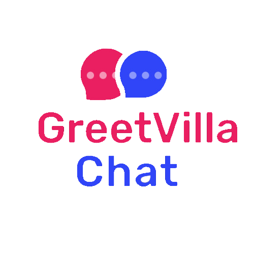

<br />
<p align="center">
  <a href="https://github.com/dcyrus/GV-Chat/tree/master">
    
  </a>

  <h3 align="center">GV Chat App</h3>

  <p align="center">
    Chat with friends 1-on-1 or in groups privately
    <br />
    <a href="https://github.com/dcyrus/GV-Chat/tree/master"><strong>Explore the docs »</strong></a>
    <br />
    <br />
    <a href="https://github.com/dcyrus/GV-Chat/issues">Report Bug</a>
    ·
    <a href="https://github.com/dcyrus/GV-Chat/issues">Request Feature</a>
  </p>
</p>


<!-- TABLE OF CONTENTS -->
<details open="open">
  <summary>Table of Contents</summary>
  <ol>
    <li>
      <a href="#about-the-project">About The Project</a>
      <ul>
        <li><a href="#features">Features</a></li>
        <li><a href="#built-with">Built With</a></li>
      </ul>
    </li>
    <li>
      <a href="#getting-started">Getting Started</a>
      <ul>
        <li><a href="#prerequisites">Prerequisites</a></li>
        <li><a href="#dependencies">Dependencies</a></li>
      </ul>
    </li>
    <li><a href="#guide">Guide</a></li>
    <li><a href="#contributing">Contributing</a></li>
    <li><a href="#contact">Contact</a></li>
  </ol>
</details>


<!-- ABOUT THE PROJECT -->
## About The Project

[![Product Name Screen Shot][product-screenshot]](https://play.google.com/store/apps/details?id=com.greetvilla.gvchat)

GV Chat is chat app developed with flutter and firebase. It allows you to chat with users 1-on-1 or in groups. All the messages are secured with AES encryption algorithm. You can sign up with a unique username and email. You can also login with your google account and continue by adding your username. You can change your username anytime you want from your profile screen. You can also set your display picture which can again be changed whenever needed. You can create new group and add bunch of members with no restrictions. Group admin always has right to add new participant anytime, remove any existing member and even make any other member a admin of the group. This README.md file contains every detail about the project.

[Download this on Play Store](https://play.google.com/store/apps/details?id=com.greetvilla.gvchat)

### Features

* Signup - Login / Sign in with google
* Chat 1-on-1
* Message encryption
* Create Groups - (Add/Remove participants, Make admin)
* Set up profile
* Instant search user with starting characters of their username
* Push Notifications


### Built With

* [Flutter](https://flutter.dev)
* [Firebase](https://firebase.google.com)
* [Visual Studio Code](https://code.visualstudio.com)
* [Android Studio](https://developer.android.com/studio/index.html/)


<!-- GETTING STARTED -->
## Getting Started

If you want to test the app, first run `flutter devices` to check connected devices. Then run:
 ```sh
  flutter run -d DEVICE
  ```
 
### Prerequisites

First, clone this repository or download the zip.

  ```sh
  git clone https://github.com/dcyrus/GV-Chat.git
  ```
  
Then, download either Android Studio or Visual Studio Code, with their respective Flutter editor plugins. For more information about Flutter installation procedure, check the official install guide.

Install dependencies from `pubspec.yaml` by runnung `flutter packages get` from the project root.

### Dependencies

* [google_fonts](https://pub.dev/packages/google_fonts)
* [focused_menu](https://pub.dev/packages/focused_menu)
* [firebase_auth](https://pub.dev/packages/firebase_auth)
* [cloud_firestore](https://pub.dev/packages/cloud_firestore)
* [firebase_core](https://pub.dev/packages/firebase_core)
* [firebase_storage](https://pub.dev/packages/firebase_storage)
* [image_picker](https://pub.dev/packages/image_picker)
* [share_plus](https://pub.dev/packages/share_plus)
* [new_version](https://pub.dev/packages/new_version)
* [encrypt](https://pub.dev/packages/encrypt)
* [firebase_messaging](https://pub.dev/packages/firebase_messaging)
* [google_sign_in](https://pub.dev/packages/google_sign_in)
* [font_awesome_flutter](https://pub.dev/packages/font_awesome_flutter)
* [url_launcher](https://pub.dev/packages/url_launcher)

<!-- USAGE EXAMPLES -->
## Guide

This section will explain the basic prototype of the entire application.

If the user is logged in ContactsScreen (/screens/contacts_screen.dart) will be displayed else WelcomeScreen will be displayed (/screens/welcome_screen2.dart).
<br />
## Welcome Screen

[![Product Name Screen Shot][1.png]](https://github.com/dcyrus/GV-Chat/blob/master/lib/screens/welcome_screen2.dart)


## Login and Signup Screen

[![Product Name Screen Shot][6.png]](https://github.com/dcyrus/GV-Chat/tree/master/lib/screens)

## Contacts Screen

[![Product Name Screen Shot][2.png]](https://github.com/dcyrus/GV-Chat/blob/master/lib/screens/contacts_screen.dart)

## App Drawer

[![Product Name Screen Shot][3.png]](https://github.com/dcyrus/GV-Chat/tree/master/lib/screens)

## Chat Screen

[![Product Name Screen Shot][4.png]](https://github.com/dcyrus/GV-Chat/blob/master/lib/screens/chat_screen.dart)

## Group Detail Screen

[![Product Name Screen Shot][5.png]](https://github.com/dcyrus/GV-Chat/blob/master/lib/screens/group_detail_screen.dart)


<!-- CONTRIBUTING -->
## Contributing

Contributions are what make the open source community such an amazing place to be learn, inspire, and create. Any contributions you make are **greatly appreciated**.

1. Fork the Project
2. Create your Feature Branch (`git checkout -b feature/AmazingFeature`)
3. Commit your Changes (`git commit -m 'Add some AmazingFeature'`)
4. Push to the Branch (`git push origin feature/AmazingFeature`)
5. Open a Pull Request


<!-- CONTACT -->
## Contact

Cyrus Dumbwani - [LinkedIn](https://www.linkedin.com/in/cyrusdumbwani/) - cyrusdumbwani@gmail.com


<!-- MARKDOWN LINKS & IMAGES -->
<!-- https://www.markdownguide.org/basic-syntax/#reference-style-links -->
[contributors-shield]: https://img.shields.io/github/contributors/othneildrew/Best-README-Template.svg?style=for-the-badge
[contributors-url]: https://github.com/othneildrew/Best-README-Template/graphs/contributors
[forks-shield]: https://img.shields.io/github/forks/othneildrew/Best-README-Template.svg?style=for-the-badge
[forks-url]: https://github.com/othneildrew/Best-README-Template/network/members
[stars-shield]: https://img.shields.io/github/stars/othneildrew/Best-README-Template.svg?style=for-the-badge
[stars-url]: https://github.com/othneildrew/Best-README-Template/stargazers
[issues-shield]: https://img.shields.io/github/issues/othneildrew/Best-README-Template.svg?style=for-the-badge
[issues-url]: https://github.com/othneildrew/Best-README-Template/issues
[license-shield]: https://img.shields.io/github/license/othneildrew/Best-README-Template.svg?style=for-the-badge
[license-url]: https://github.com/othneildrew/Best-README-Template/blob/master/LICENSE.txt
[linkedin-shield]: https://img.shields.io/badge/-LinkedIn-black.svg?style=for-the-badge&logo=linkedin&colorB=555
[linkedin-url]: https://linkedin.com/in/othneildrew
[product-screenshot]: assets/images/screenshots.png
[1.png]: assets/images/1.png
[2.png]: assets/images/2.png
[3.png]: assets/images/3.png
[4.png]: assets/images/4.png
[5.png]: assets/images/5.png
[6.png]: assets/images/6.png
